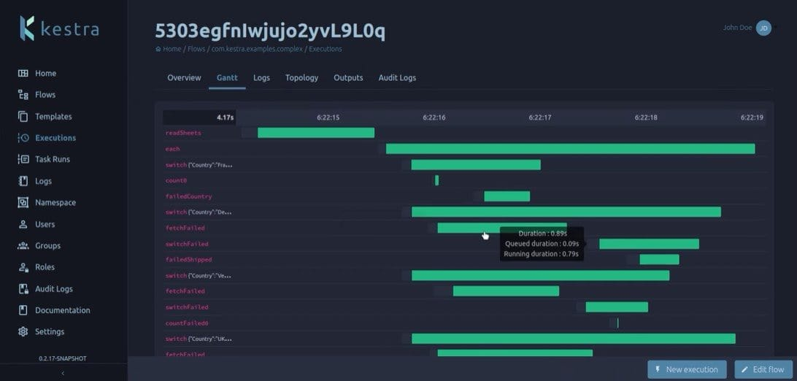

# Kestra CI/CD pipeline

<a href="https://dash.elest.io/deploy?source=cicd&social=dockerCompose&url=https://github.com/elestio-examples/kestra"></a>

Deploy Kestra server with CI/CD on Elestio


<br/>
<br/>

# Once deployed ...

You can open Kestra ADMIN UI here:

    URL: https://[CI_CD_DOMAIN]
    username: admin
    password: [ADMIN_PASSWORD]

You can open pgAdmin web UI here:

    URL: https://[CI_CD_DOMAIN]:6443
    email: [ADMIN_EMAIL]
    password: [ADMIN_PASSWORD]

Documentation URL: https://kestra.io/docs/user-interface-guide/
--------------------------------------------------------------------------------------------------
#  Examples:-

```
Hello world example to test flow:-
id: helloWorld
namespace: prod
description: This flow logs a message to the console

tasks:
  - id: hello
    type: io.kestra.core.tasks.log.Log
    message: Hello world!
```

Get more examples at github.com/kestra-io/examples